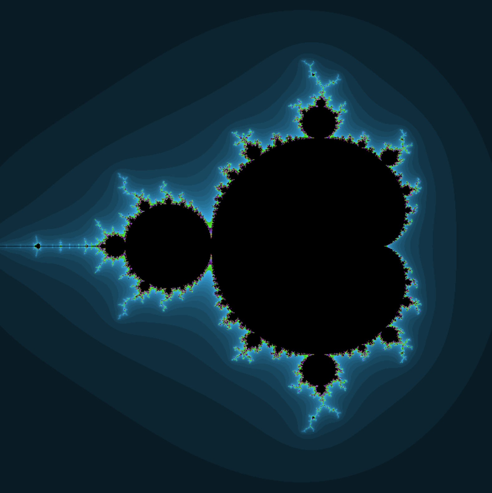
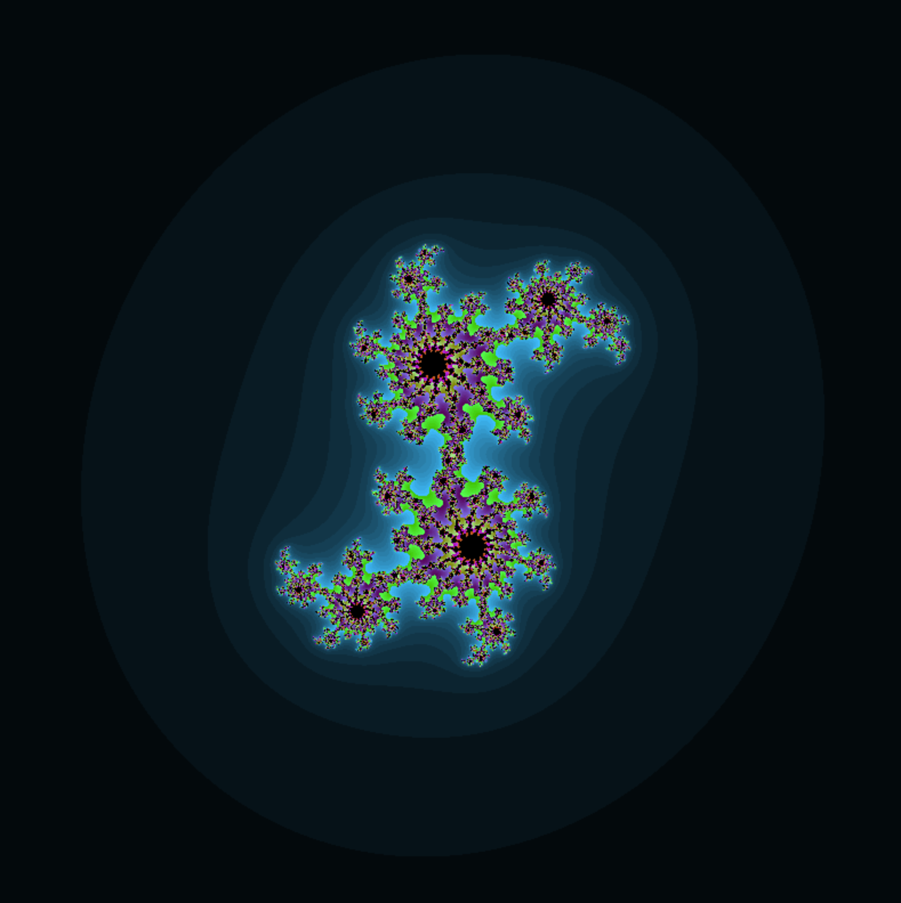
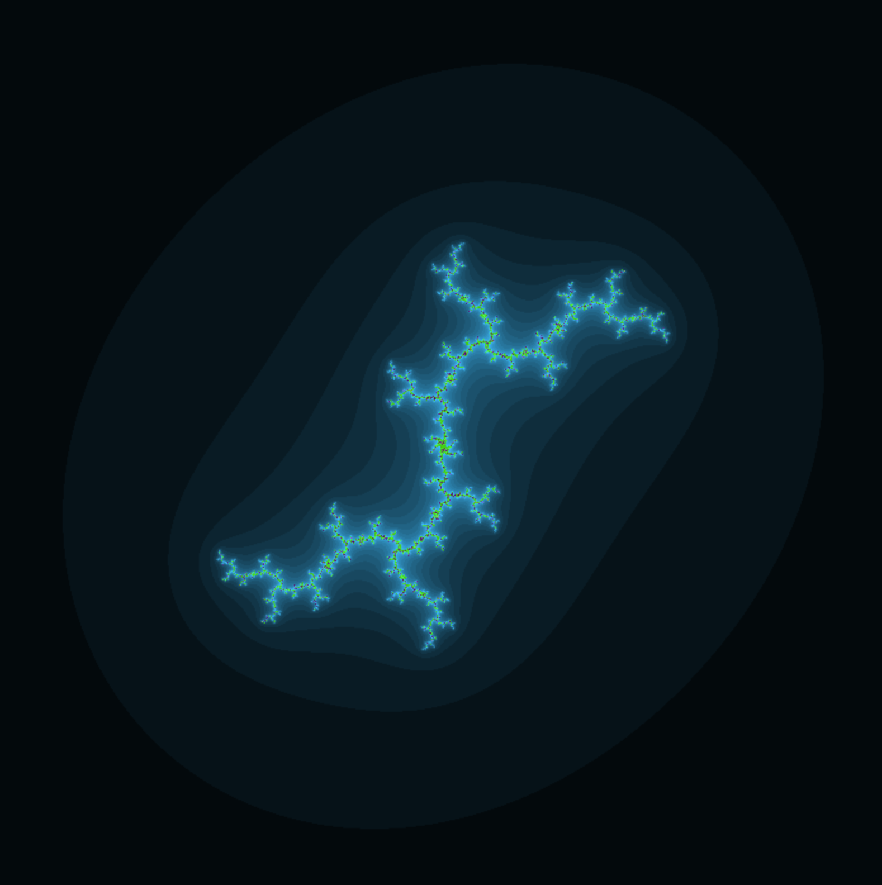
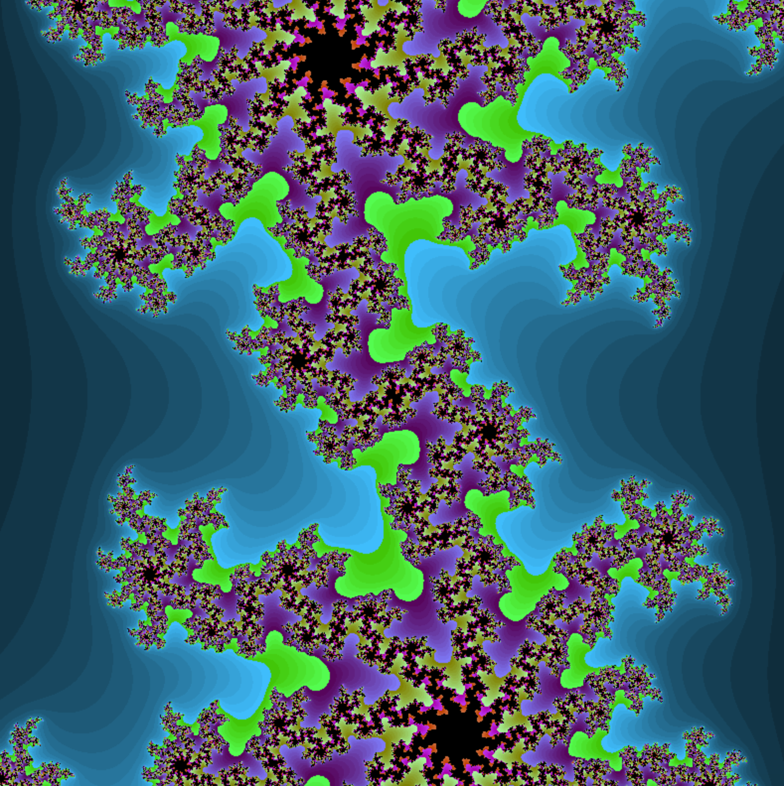

# Fractol

## Overview

Fractol is a captivating computer graphics exploration project that delves into the beauty and complexity of fractals. Developed using the C programming language and the MiniLibX library, this project renders stunning visual representations of the Julia and Mandelbrot fractal sets. Beyond being a visual spectacle, Fractol serves as a practical application of complex numbers, graphics optimization, and event handling in graphics programming.

## Installation

To install Fract'ol, follow these steps:

```bash
git clone [git@github.com:oumimoun/fractol.git]
cd fractol
make
```
Ensure that the MiniLibX library is installed on your system before compiling.

## Usage
Run the program with the following command:

```bash
./fractol [fractal-type]
```
Replace [fractal-type] with either M for Mandelbrot or J for Julia to view the respective fractal set.

## Examples
```bash
# Generate Mandelbrot set
./fractol M

# Generate Julia set with custom parameters
./fractol M 0.5646454 0.954
```
## FRACTAL GEOMETRY
Fractal geometry is a branch of mathematics that studies complex shapes and structures exhibiting self-similarity at different scales. A fractal is a geometric pattern or object that repeats itself at varying levels of magnification. The defining characteristic of fractals is their ability to replicate similar structures infinitely within a finite space.

A quick mathematical expression for a simple fractal structure, such as the Koch snowflake, can be represented as follows:

\[ F_{n+1} = F_n \cdot \frac{1}{3} + \text{[rotate]}(F_n) \cdot \frac{1}{3} + F_n \cdot \frac{1}{3} \]

In this expression, \( F_n \) represents the fractal at iteration \( n \), and the formula describes how each iteration generates new components based on the previous ones. The recursive nature of the expression leads to the self-similarity observed in fractal patterns.

## MANDELBROT
The Mandelbrot set is a set of complex numbers in the complex plane, defined by iterating a simple mathematical expression. The set is named after the mathematician Benoît B. Mandelbrot. The mathematical expression for determining whether a complex number \(c\) belongs to the Mandelbrot set is:

\[ Z_{n+1} = Z_{n}^2 + c \]

where \(Z_{0} = 0\). The iteration continues, and if the magnitude of \(Z_{n}\) remains bounded (does not become infinitely large) for all iterations, then the complex number \(c\) is considered part of the Mandelbrot set. In mathematical terms:

\[ |Z_{n}| \leq 2 \text{ for all } n \]

If \(|Z_{n}|\) exceeds 2 at any iteration, \(c\) is not part of the Mandelbrot set. The Mandelbrot set is often visualized in the complex plane, with different colors or shades representing whether a point is inside or outside the set based on the number of iterations required for the magnitude to exceed 2.


## JULIA
The Julia set is another set of complex numbers in the complex plane, defined through iteration of a specific mathematical expression. The Julia set is associated with a fixed complex number \(c\), and the iteration is determined by the following mathematical expression:

\[ Z_{n+1} = Z_{n}^2 + c \]

where \(Z_{0}\) is the initial complex number. Similar to the Mandelbrot set, the iteration continues, and if the magnitude of \(Z_{n}\) remains bounded (does not become infinitely large) for all iterations, then \(Z_{0}\) is considered part of the Julia set associated with the fixed \(c\). In mathematical terms:

\[ |Z_{n}| \leq 2 \text{ for all } n \]

If \(|Z_{n}|\) exceeds 2 at any iteration, \(Z_{0}\) is not part of the Julia set. The Julia set exhibits intricate and complex fractal patterns, and different Julia sets can be generated by varying the fixed complex number \(c\).




## COMPLEX NUMBERS
Certainly! Complex numbers are numbers that have both a real part and an imaginary part. A complex number is typically represented in the form \(a + bi\), where \(a\) is the real part, \(b\) is the imaginary part, and \(i\) is the imaginary unit, defined as the square root of -1.

Mathematically, a complex number \(z\) is expressed as:

\[ z = a + bi \]

Here,
- \(a\) is the real part,
- \(b\) is the imaginary part,
- \(i\) is the imaginary unit (\(i^2 = -1\)).

Complex numbers are fundamental in mathematics and are widely used in various fields, including physics and engineering, to represent quantities with both magnitude and direction.
